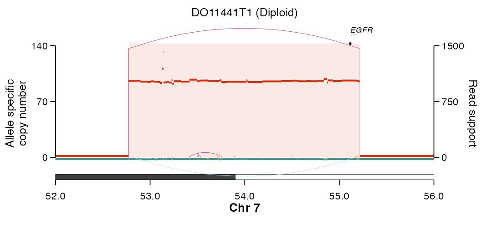
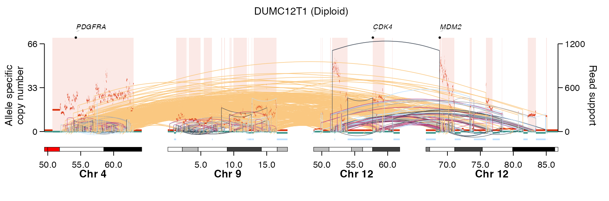

# EpiTracer

<!-- badges: start -->
<!-- badges: end -->

> **EpiTracer** — *calling and visualising extrachromosomal circular DNA
> amplicons likely generated from simple excision events.*

It detects such amplicons from whole-genome sequencing (WGS) data and visualises
the structural rearrangements underlying focal amplifications. The package
provides two functions:

| Function | What it does |
| :--- | :--- |
| **`call_episomal_ecdna()`** | Flags ecDNA amplicons whose structure fits the **episome** model — a circle bounded by a duplication (DUP) breakpoint, excised from an otherwise non-amplified region, often leaving a deletion **"excision scar"**. |
| **`plot_sv_linear()`** | Draws allele-specific copy number and structural variant arcs for one or many loci on a single concatenated axis — with karyotype ideograms, LOH / deletion bars and gene labels (PDF). Auto-detects amplicons and draws the SVs interconnecting them. |

**Single locus** — an episomal *EGFR* ecDNA in `DO11441T1`: a boundary
duplication (magenta arc reaching the top) with its **excision-scar** deletion
(light-blue arc below the baseline), over an ~100-copy amplicon.



**Multiple loci** — a multi-fragment co-amplification hub in `DUMC12T1`:
*PDGFRA* (chr4), a chr9p amplicon and *CDK4* / *MDM2* (chr12) amplicons, auto-
detected and drawn side-by-side on one axis with the structural variants
interconnecting them.



---

## Installation

Install with `BiocManager`, which resolves the Bioconductor
(`GenomicRanges`, `regioneR`), GitHub ([`gUtils`](https://github.com/mskilab/gUtils))
and `Remotes:` dependencies in one call:

```r
if (!requireNamespace("BiocManager", quietly = TRUE)) install.packages("BiocManager")
BiocManager::install("alhafidzhamdan/EpiTracer")
```

---

## Data requirement

> [!IMPORTANT]
> Copy-number variant (CNV) and structural variant (SV) inputs must come from
> [PURPLE](https://github.com/hartwigmedical/hmftools/tree/master/purple), part
> of the Hartwig Medical Foundation (HMF) pipeline. EpiTracer relies on accurate
> copy-number aware SV calls, critical in nominating amplicons formed via simple
> episomal exclusion events. Should they choose, users may opt to coerce the
> appropriate required metadata derived from other SV and CNV callers, although
> this is not the recommended option.

`call_episomal_ecdna()` expects ecDNA amplicon regions from
[**AmpliconArchitect**](https://github.com/AmpliconSuite/AmpliconArchitect) and
SV / copy-number data from [**PURPLE**](https://github.com/hartwigmedical/hmftools/tree/master/purple)
(HMF pipeline), each a `GRanges` with these metadata columns:

| Object (source) | Required metadata columns |
| :--- | :--- |
| `ecdna_gr` (AmpliconArchitect) | `ID`, `WGS_ID` |
| `breakpoints_gr` (PURPLE) | `WGS_ID`, `event`, `svclass`, `PURPLE_AF`, `PURPLE_JCN`, `VF`, `PURPLE_CN`, `insLen`, `HOMLEN` |
| `cnv_gr` (PURPLE) | `sample`, `copyNumber`, `ploidy`, `majorAlleleCopyNumber`, `minorAlleleCopyNumber` |
| `cancer_genes_gr` | `gene` (gene symbol; annotates overlapping breakpoints with the oncogene) |

`plot_sv_linear()` uses PURPLE CNV segments (`cnv_data`) and PURPLE SV / BEDPE
breakpoints (`sv_data`) for the same sample.

---

## Quick start

```r
library(EpiTracer)

## 1. Call episomal ecDNA (inputs are GRanges from AmpliconArchitect + PURPLE) --
episomal <- call_episomal_ecdna(
  ecdna_gr        = ecdna_gr,        # amplicon regions; needs $ID, $WGS_ID
  breakpoints_gr  = breakpoints_gr,  # PURPLE SV breakpoints
  cnv_gr          = cnv_gr,          # PURPLE allele-specific CN segments
  cancer_genes_gr = cancer_genes_gr, # cancer-gene loci for annotation
  ext             = 1e7,
  mc.cores        = 4
)

## 2a. Plot a single focused locus ------------------------------------------
##     (karyotype / gene_coord default to bundled hg38 references;
##      wgd_data is optional — supply it to annotate WGD status in the title)
plot_sv_linear(
  sample     = "DO11441T1",
  cnv_data   = cnv_df, sv_data = sv_df,
  chromosome = "chr7",
  chromosome_range = matrix(c(52e6, 56e6), nrow = 1),
  outdir     = "plots"
)

## 2b. Plot every amplified locus, interconnected (multi-fragment ecDNA hub) --
plot_sv_linear(
  sample    = "DUMC12T1",
  cnv_data  = cnv_df, sv_data = sv_df, wgd_data = wgd_df,
  outdir    = "plots",   # loci auto-detected; or events = "homdel", loci = c("chr4:...", ...)
  flank_pct = 10         # extend each auto-detected window by ±10%
)
```

---

## How the caller works — the episome heuristic

For each amplicon, `call_episomal_ecdna()`:

1. finds **DUP breakpoints at the amplicon boundaries** that are themselves
   amplified (`PURPLE_CN > 3 × ploidy`);
2. requires the boundary DUP to carry the **highest variant fraction (VF)** of
   any DUP in the amplicon;
3. requires the chromosomal segments immediately **flanking both boundaries to
   be non-gained** (consistent with a circle excised from a diploid region);
4. flags a shared flanking **deletion** as a candidate **excision scar**.

---

## Arguments

### `call_episomal_ecdna()`

Detects episomal ecDNA amplicons. Only the four GRanges inputs are **required**.

**Required**

| Argument | Description |
| :--- | :--- |
| `ecdna_gr`        | ecDNA amplicon regions from **AmpliconArchitect** (GRanges); needs `ID`, `WGS_ID`. |
| `breakpoints_gr`  | **PURPLE** SV breakpoints (GRanges); see *Data requirement*. |
| `cnv_gr`          | **PURPLE** allele-specific CN segments (GRanges). |
| `cancer_genes_gr` | Cancer-gene loci (GRanges) with a `gene` column; annotates breakpoints with the overlapping oncogene. |

**Optional**

| Argument | Default | Description |
| :--- | :--- | :--- |
| `ext`      | `1e7`   | bp to extend each amplicon by when searching for boundary SVs. |
| `mc.cores` | `1`     | Cores for parallel processing across amplicons. |
| `verbose`  | `FALSE` | Print per-amplicon progress. |

Returns a `data.table` of annotated breakpoints with per-amplicon episomal
classifications (`episomal`, `has_excision_scar`, …).

### `plot_sv_linear()`

Only `sample`, `cnv_data` and `sv_data` are **required**; everything else is
optional.

**Required**

| Argument | Description |
| :--- | :--- |
| `sample`   | Sample identifier (matched in `cnv_data` / `sv_data`). |
| `cnv_data` | PURPLE CN segments: `sample`, `seqnames`, `start`, `end`, `copyNumber`, `ploidy`, `majorAlleleCopyNumber`, `minorAlleleCopyNumber`. |
| `sv_data`  | PURPLE SVs / BEDPE: `chrom1`, `start1`, `chrom2`, `start2`, `strand1`, `strand2`, `svclass`, `VF`, `JCN`, `sample`. |

**Optional — references & sample metadata**

| Argument | Default | Description |
| :--- | :--- | :--- |
| `wgd_data`       | `NULL` | WGD table (`Polyploidy` column); annotates WGD status in the title when supplied. |
| `karyotype`      | bundled hg38 | Ideogram bands (data.frame or `.rds` path). |
| `gene_coord`     | bundled hg38 oncogenes | Gene coordinates (data.frame or BED path). |
| `wgd_sample_col` | `NULL` | Sample-id column in `wgd_data` (`sample`, else `WGS_ID`). |

**Optional — which loci to plot**

| Argument | Default | Description |
| :--- | :--- | :--- |
| `chromosome`       | `NULL`  | Chromosome(s) to display. |
| `chromosome_range` | `NULL`  | Two-column start/end window(s), one row per `chromosome`. |
| `loci`             | `NULL`  | Explicit loci: data.frame (`chr`,`start`,`end`) or `"chr:start-end"` strings; overrides `chromosome`. |
| `events`           | `"amp"` | Auto-detect target(s): `"amp"`, `"gain"`, `"loh"`, `"homdel"`. |
| `cluster_gap`      | `5e6`   | Events more than this many bp apart become separate loci. |
| `flank_pct`        | `10`    | Extend each auto-detected window by ±X% of its width. |
| `min_amp_width`    | `1e5`   | Drop auto-detected loci with total event span below this (bp). |

**Optional — event thresholds**

| Argument | Default | Description |
| :--- | :--- | :--- |
| `min_cn_ratio`  | `3`   | Amplification: `copyNumber > min_cn_ratio × ploidy`. |
| `gain_ratio`    | `1.4` | Gain: `> gain_ratio × ploidy`, but not amplified. |
| `loh_thresh`    | `0.5` | LOH: `minorAlleleCopyNumber < loh_thresh`. |
| `homdel_thresh` | `0.5` | Homozygous deletion: `copyNumber < homdel_thresh`. |

**Optional — gene labels**

| Argument | Default | Description |
| :--- | :--- | :--- |
| `genes_to_highlight` | `NULL`  | Gene symbols to label (default oncogene panel if `NULL`). |
| `gene_label_angle`   | `NULL`  | Label rotation in degrees; auto-angles when crowded if `NULL`. |
| `repel_labels`       | `TRUE`  | De-collide labels with ggrepel. |
| `displayExon`        | `FALSE` | Draw exon models (requires `cds_gr`). |
| `cds_gr`             | `NULL`  | GRanges of CDS/exon ranges (`gene_name`), for `displayExon`. |

**Optional — layout & appearance**

| Argument | Default | Description |
| :--- | :--- | :--- |
| `cn_max`               | `NULL`  | Copy-number axis top (auto from data if `NULL`). |
| `gap_frac`             | `0.06`  | Gap between loci as a fraction of total width. |
| `offset_gene`          | `1.15`  | Gene-label height relative to max CN. |
| `ymax_highlight_ratio` | `1.08`  | Height of amp / homdel shading relative to max CN. |
| `karyotype_rel_size`   | `0.048` | Ideogram height relative to the CN axis. |
| `loh_position_ratio`   | `0.5`   | LOH / homdel bar position within the ideogram gap. |
| `highlight_amp`        | `TRUE`  | Shade amplified segments. |
| `highlight_hom_del`    | `TRUE`  | Shade homozygously deleted segments. |
| `plot_width_custom`    | `NULL`  | Override output width (inches). |
| `plot_height_custom`   | `NULL`  | Override output height (inches). |

**Optional — output**

| Argument | Default | Description |
| :--- | :--- | :--- |
| `outdir`  | `NULL`  | Directory to write the PDF; if `NULL`, only the plot object is returned. |
| `save`    | `TRUE`  | Write the PDF when `outdir` is supplied. |
| `verbose` | `FALSE` | Print progress / diagnostics. |

Returns the `ggplot` object (invisibly when a file is written); any written PDF
path is attached as `attr(p, "path")`.

---

## Status

Early development (`v0.0.0.9000`) — the API may change.

## License

MIT © Alhafidz Hamdan
