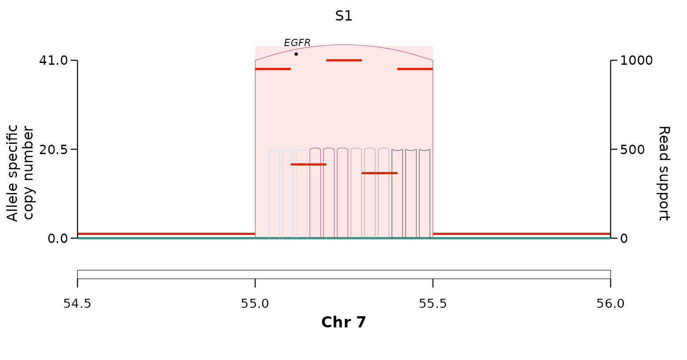
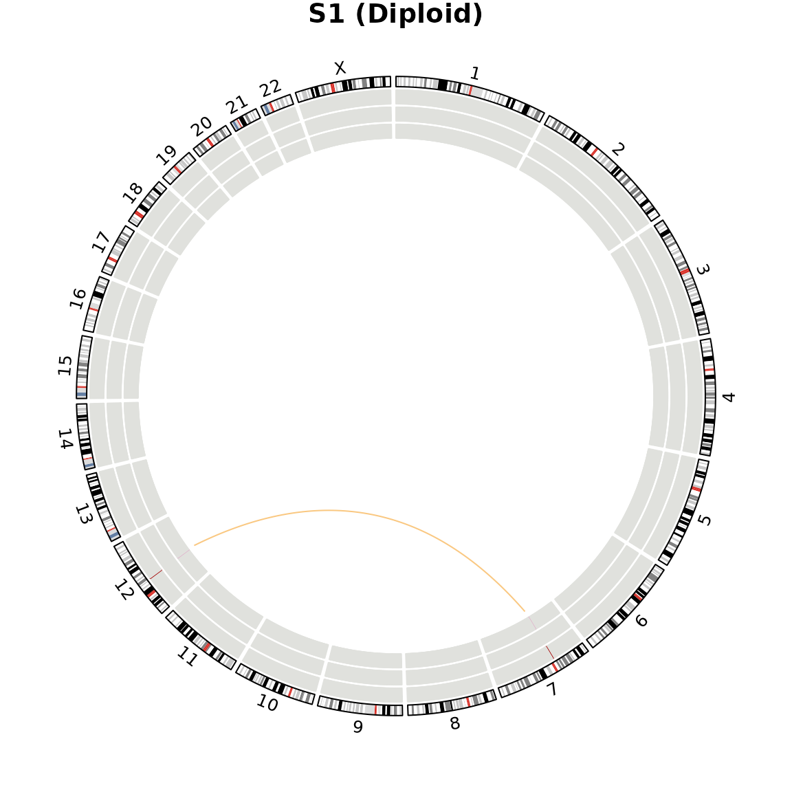
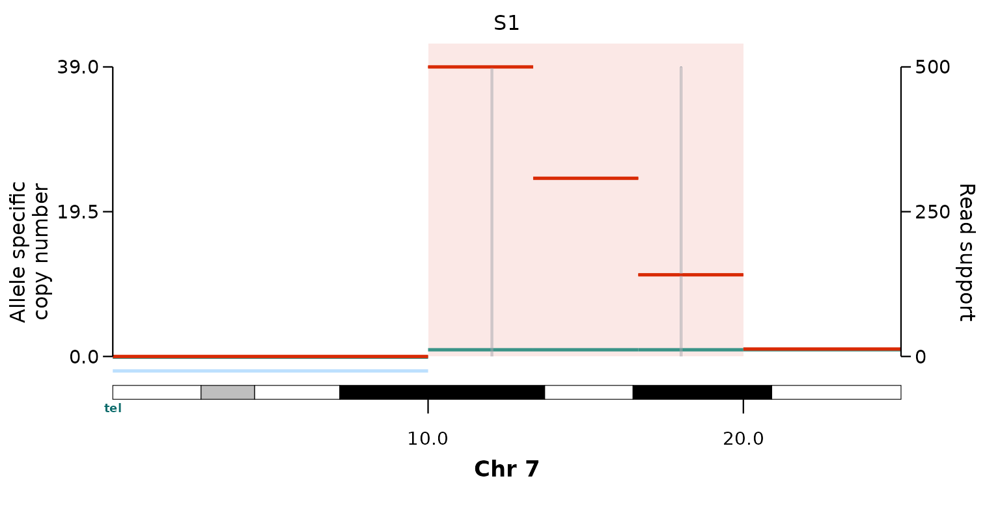
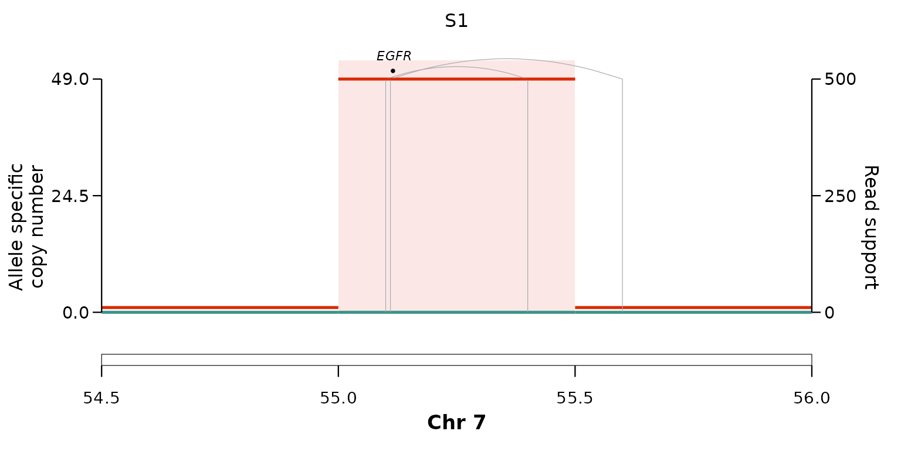
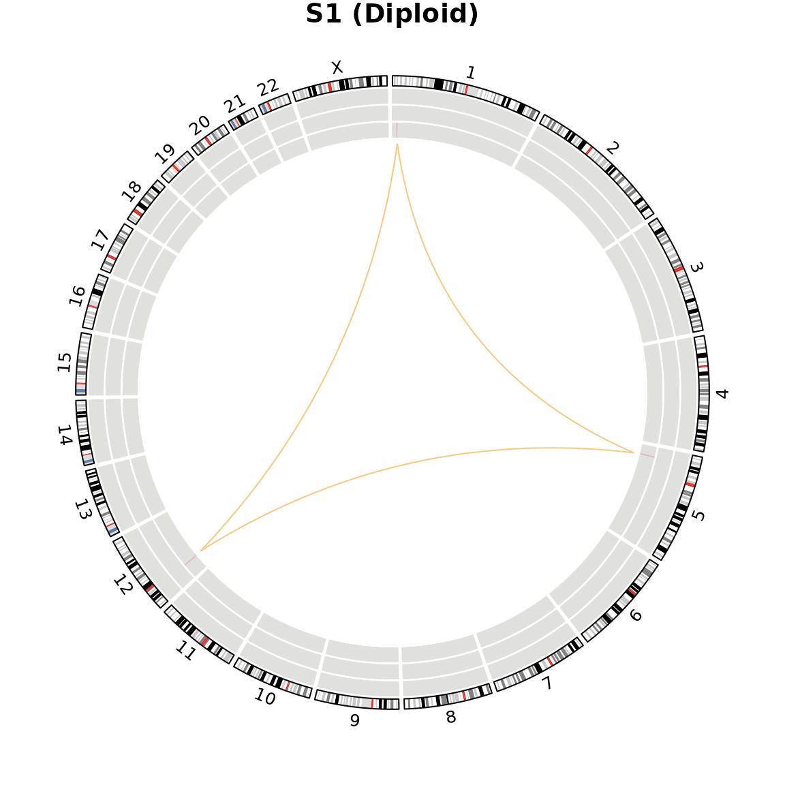

# Calling rearrangement mechanisms

[`call_simple_excision()`](https://alhafidzhamdan.github.io/EpiTracer/reference/call_simple_excision.md)
asks *“is this a simple-excision circle (an episome)?”*. The **mechanism
callers** ask the complementary question — *by which route did a focal
amplification, or a complex rearrangement, form?* Each one takes the
same inputs as the episomal caller (`breakpoints_gr`, `cnv_gr`,
`cancer_genes_gr`, and an optional `ecdna_gr`) and returns those
breakpoints annotated with **one mechanism’s flag**.

The mechanisms are not all amplifications:
chromothripsis-within-an-ecDNA, micronucleation and
breakage–fusion–bridge produce amplified segments, whereas
breakage–replication/fusion and chromoplexy are balanced rearrangement
signatures that need not raise copy number. The callers are also
**independent** — an amplicon can carry more than one flag — so the
workflow is to run the relevant callers on the same inputs and join
their outputs by `WGS_ID` + `ID`.

Each section below shows the **call** and a **plot** of the underlying
event; the inputs are constructed behind the scenes.

## Chromothripsis within an ecDNA

Shattering and random rejoining inside an amplicon.
[`call_chromothripsis()`](https://alhafidzhamdan.github.io/EpiTracer/reference/call_chromothripsis.md)
scores ShatterSeek-style hallmarks over the amplified footprint: enough
internal breakpoints, the four junction orientations occurring about
equally, and an **oscillating** copy-number profile.

``` r

res <- call_chromothripsis(ecdna_gr, breakpoints_gr, cnv_gr, cancer_genes_gr)
unique(res[, c("chromothripsis", "chromothripsis_conf")])
#>    chromothripsis chromothripsis_conf
#>            <char>              <char>
#> 1:           TRUE                high
```

``` r

plot_sv_linear(sample = "S1", cnv_data = cnv_data, sv_data = sv_data,
               chromosome = "chr7", chromosome_range = matrix(c(54.5e6, 56e6), nrow = 1))
```



The oscillating copy number and the fan of differently-oriented internal
junctions are the shattering signature; a clean episome (only a boundary
junction) returns `chromothripsis = "FALSE"`.

## Micronucleation — two ecDNAs fused in a micronucleus

[`call_micronucleation()`](https://alhafidzhamdan.github.io/EpiTracer/reference/call_micronucleation.md)
flags an amplicon joined to *another amplified locus on a non-homologous
chromosome* by a high-VF interchromosomal translocation. Fusing two
different chromosomes into one amplicon is only possible if both were
co-encapsulated — the signature of two episomal ecDNAs recombined in a
micronucleus after shattering.

``` r

res <- call_micronucleation(ecdna_gr, breakpoints_gr, cnv_gr, cancer_genes_gr)
unique(res$micronucleation)
#> [1] "TRUE"
```

A genome-wide view
([`plot_sv_circos()`](https://alhafidzhamdan.github.io/EpiTracer/reference/plot_sv_circos.md))
shows the two amplified loci on chr7 and chr12 joined by the
translocation arc:

``` r

plot_sv_circos(sample = "S1", sv_data = sv_data, cnv_data = cnv_data)
```



## Breakage–fusion–bridge (BFB)

Classical BFB is **telomeric**: after telomere loss, sister chromatids
fuse and the dicentric bridge breaks unevenly each cycle, building a
fold-back amplicon that is *terminal on one arm*, carries a *distal
deletion to the telomere*, and shows a copy-number **staircase**.
[`call_bfb()`](https://alhafidzhamdan.github.io/EpiTracer/reference/call_bfb.md)
requires all three, and needs centromere / chromosome-length references
to locate the telomere.

``` r

res <- call_bfb(ecdna_gr, breakpoints_gr, cnv_gr, cancer_genes_gr,
                centromeres = load_centromeres("hg38"),
                chrom_lengths = load_chrom_lengths("hg38"))
unique(res[, c("bfb", "bfb_anchor", "n_foldbacks")])
#>       bfb bfb_anchor n_foldbacks
#>    <char>     <char>       <int>
#> 1:   TRUE p-telomere           2
```

``` r

plot_sv_linear(sample = "S1", cnv_data = cnv_data, sv_data = sv_data,
               chromosome = "chr7", chromosome_range = matrix(c(1, 25e6), nrow = 1))
```



The distal deletion to the p-telomere and the descending copy-number
staircase are the BFB signature. Drop any one hallmark — a diploid
terminus, a flat plateau, or clustered fold-backs — and the call reverts
to `"FALSE"`.

## Breakage–replication/fusion (BRF)

BRF (Mendez-Dorantes / Zhang / Pellman, *Nat Genet* 2026) leaves
**adjacent parallel breakpoints** — two same-orientation breakends,
close together, from *distinct* junctions. Unlike BFB it is not
telomere-gated and need not build a staircase.

``` r

res <- call_brf(ecdna_gr, breakpoints_gr, cnv_gr, cancer_genes_gr)
unique(res[, c("brf", "n_parallel_pairs")])
#>       brf n_parallel_pairs
#>    <char>            <int>
#> 1:   TRUE                1
```

``` r

plot_sv_linear(sample = "S1", cnv_data = cnv_data, sv_data = sv_data,
               chromosome = "chr7", chromosome_range = matrix(c(54.5e6, 56e6), nrow = 1))
```



## Chromoplexy

Chromoplexy (Baca *et al.* 2013) is a **closed, balanced** chain of
rearrangements cycling through several chromosomes back to its start, at
*low* copy number. It is genome-wide rather than amplicon-anchored, so
[`call_chromoplexy()`](https://alhafidzhamdan.github.io/EpiTracer/reference/call_chromoplexy.md)
takes just `breakpoints_gr` and `cnv_gr` and returns **one row per
chain**.

``` r

res <- call_chromoplexy(breakpoints_gr, cnv_gr)
res[, c("topology", "n_junctions", "n_chromosomes", "chromosomes")]
#>    topology n_junctions n_chromosomes     chromosomes
#>      <char>       <int>         <int>          <char>
#> 1:    cycle           3             3 chr1,chr12,chr5
```

``` r

plot_sv_circos(sample = "S1", sv_data = sv_data, cnv_data = cnv_data)
```



The closed chr1 → chr5 → chr12 → chr1 cycle at diploid copy number is
the chromoplexy signature. An **open** chain, or an **amplified** cycle
(an amplicon, not a balanced event), is not called.

## Combining the callers

Because each caller reports one signature and leaves the others
untouched, run the relevant callers on the same inputs and join their
per-breakpoint outputs by `WGS_ID` + `ID`. An amplicon then carries an
explicit flag for every mechanism tested — `episomal`, `chromothripsis`,
`micronucleation`, `bfb`, `brf` — rather than being forced into a single
class. See
[`?call_simple_excision`](https://alhafidzhamdan.github.io/EpiTracer/reference/call_simple_excision.md)
for the shared input contract, and
[`vignette("reconstruction")`](https://alhafidzhamdan.github.io/EpiTracer/articles/reconstruction.md)
for reading the founder junction off a VF-stratified reconstruction.
