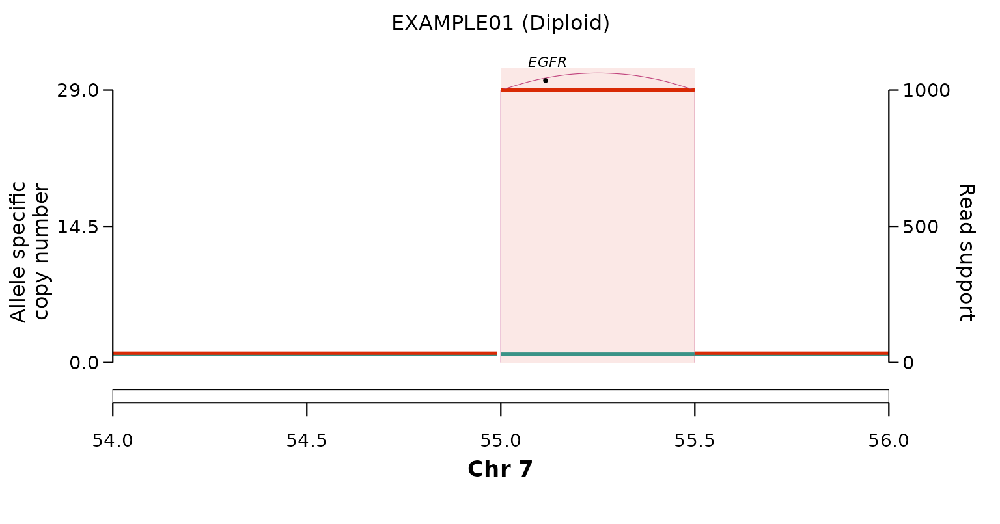
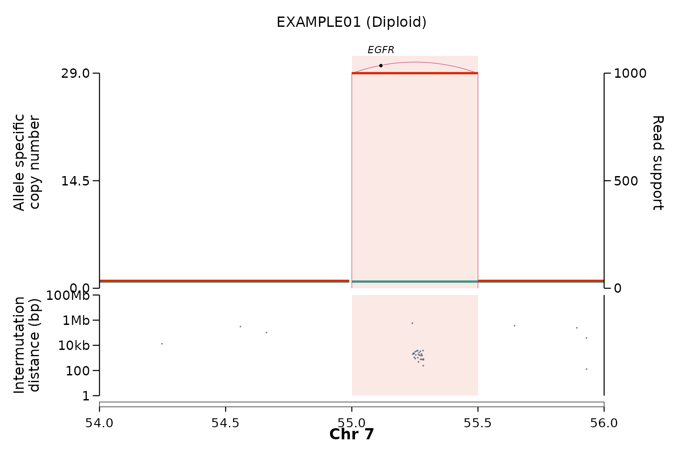

# Plotting copy number, structural variants and kataegis

[`plot_sv_linear()`](https://alhafidzhamdan.github.io/EpiTracer/reference/plot_sv_linear.md)
draws allele-specific copy number, structural-variant arcs, the
karyotype ideogram and gene labels for one or more loci on a single
concatenated x-axis. It is a general-purpose CN/SV viewer, not
amplification-only.

## A simple plot

The bundled `ex_plot_inputs` is a synthetic **EGFR amplicon** on chr7
(sample `"EXAMPLE01"`). `karyotype` and `gene_coord` are omitted, so the
bundled hg38 references are used.

``` r

p <- plot_sv_linear(
  sample   = "EXAMPLE01",
  cnv_data = ex_plot_inputs$cnv_data,
  sv_data  = ex_plot_inputs$sv_data,
  wgd_data = ex_plot_inputs$wgd_data,
  chromosome       = "chr7",
  chromosome_range = matrix(c(54e6, 56e6), nrow = 1)
)
p
```



By default the plot is returned as a `ggplot` object and nothing is
written to disk. Pass `outdir = "."` to also save a publication-ready
PDF. Omit `chromosome`/`chromosome_range` and
[`plot_sv_linear()`](https://alhafidzhamdan.github.io/EpiTracer/reference/plot_sv_linear.md)
auto-detects the amplified loci; pass `loci` for explicit windows.

## Adding an SNV panel: kataegis

Supplying `snv_data` adds a second panel of the sample’s small mutations
beneath the copy-number / SV panel, on the same genomic x-axis. With the
default `snv_y = "imd"` it is a *rainfall plot* — each SNV sits at its
intermutation distance to the previous one — so **kataegis** (localised
hypermutation) appears as a tight cluster of points dropping toward the
bottom of the panel.

The bundled `ex_snv` places an APOBEC-like kataegis shower over the EGFR
amplicon, with a few scattered background SNVs for contrast:

``` r

plot_sv_linear(
  sample   = "EXAMPLE01",
  cnv_data = ex_plot_inputs$cnv_data,
  sv_data  = ex_plot_inputs$sv_data,
  wgd_data = ex_plot_inputs$wgd_data,
  chromosome       = "chr7",
  chromosome_range = matrix(c(54e6, 56e6), nrow = 1),
  snv_data = ex_snv          # snv_y = "imd" (rainfall) by default
)
```



The kataegis cluster sits at ~100 bp–1 kb intermutation distance inside
the amplicon, well below the scattered background mutations.
`snv_y = "vaf"` or `"cn"` switch the panel to variant-allele frequency
or SNV copy number instead. See
[`?plot_sv_linear`](https://alhafidzhamdan.github.io/EpiTracer/reference/plot_sv_linear.md)
for the full set of controls, and the [reconstruction
article](https://alhafidzhamdan.github.io/EpiTracer/articles/reconstruction.md)
for the read-support-stratified
[`plot_sv_reconstruction()`](https://alhafidzhamdan.github.io/EpiTracer/reference/plot_sv_reconstruction.md).
