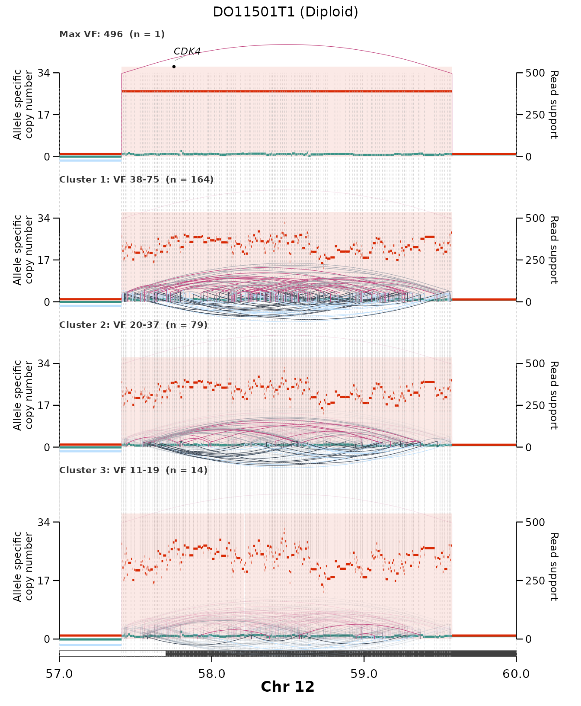

# Reconstructing a focal amplicon wave by wave

[`plot_sv_reconstruction()`](https://alhafidzhamdan.github.io/EpiTracer/reference/plot_sv_reconstruction.md)
rebuilds a focal amplicon **wave by wave**. It stratifies the
structural-variant junctions by read support (`VF`) and draws one panel
per stratum, from the highest-`VF` **founder** junction down to the
lowest-`VF` late additions — so you can read the order in which the
amplicon was assembled. (Requires the package.)

## The example data

The bundled `ex_recon_inputs` is a real, complex amplification: the
**CDK4** amplicon on chr12 in tumour sample `"DO11501T1"`, carrying
hundreds of structural-variant junctions spanning read support from `VF`
4 to 496.

``` r

nrow(ex_recon_inputs$sv_data)                     # junctions
#> [1] 259
table(ex_recon_inputs$sv_data$svclass)            # DUP / DEL / TRA / inversions
#> 
#>    DEL    DUP h2hINV t2tINV 
#>     56     56     74     73
```

## Reconstruction

``` r

plot_sv_reconstruction(
  sample   = "DO11501T1",
  cnv_data = ex_recon_inputs$cnv_data,
  sv_data  = ex_recon_inputs$sv_data,
  wgd_data = ex_recon_inputs$wgd_data,
  chromosome       = "chr12",
  chromosome_range = matrix(c(57e6, 60e6), nrow = 1),
  min_vf = 10                                     # drop the lowest-support noise
)
```



Reading it top to bottom: the first panel isolates the single
highest-`VF` **founder** junction (the earliest, highest-copy event);
each subsequent panel folds in the next-lower `VF` stratum, and the
amplified region grows as later junctions are added. Read support is
shown on the right-hand axis, and prior (higher-`VF`) junctions are
drawn faintly for context.

## Controls

By default the number of strata is chosen automatically (`k = "auto"`).
Common adjustments:

- **`k`** — fix the number of read-support strata.
- **`vf_breaks`** — explicit `VF` cut points instead of automatic
  clustering.
- **`min_vf`** — drop low-support junctions before clustering.
- **`isolate_founder = FALSE`** — keep the single top junction inside
  its cluster rather than in its own founder panel.

See
[`?plot_sv_reconstruction`](https://alhafidzhamdan.github.io/EpiTracer/reference/plot_sv_reconstruction.md)
for the full set of controls, and the [get-started
vignette](https://alhafidzhamdan.github.io/EpiTracer/articles/epitracer.md)
for the copy-number / SV viewer
[`plot_sv_linear()`](https://alhafidzhamdan.github.io/EpiTracer/reference/plot_sv_linear.md).
