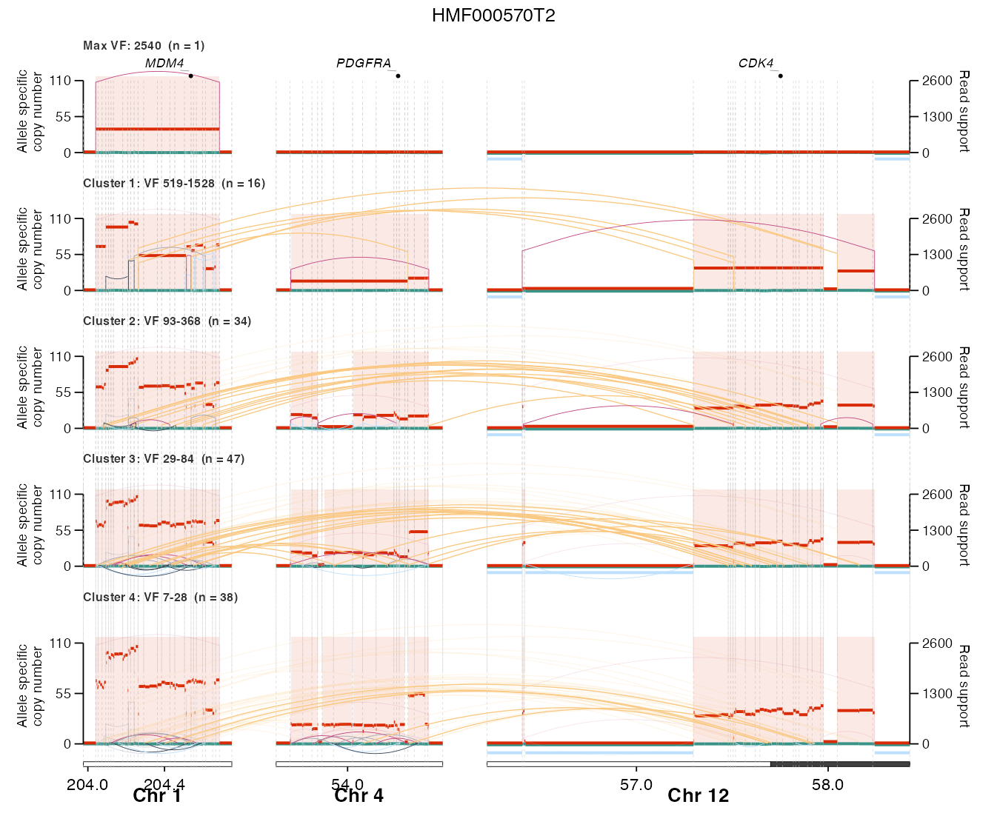
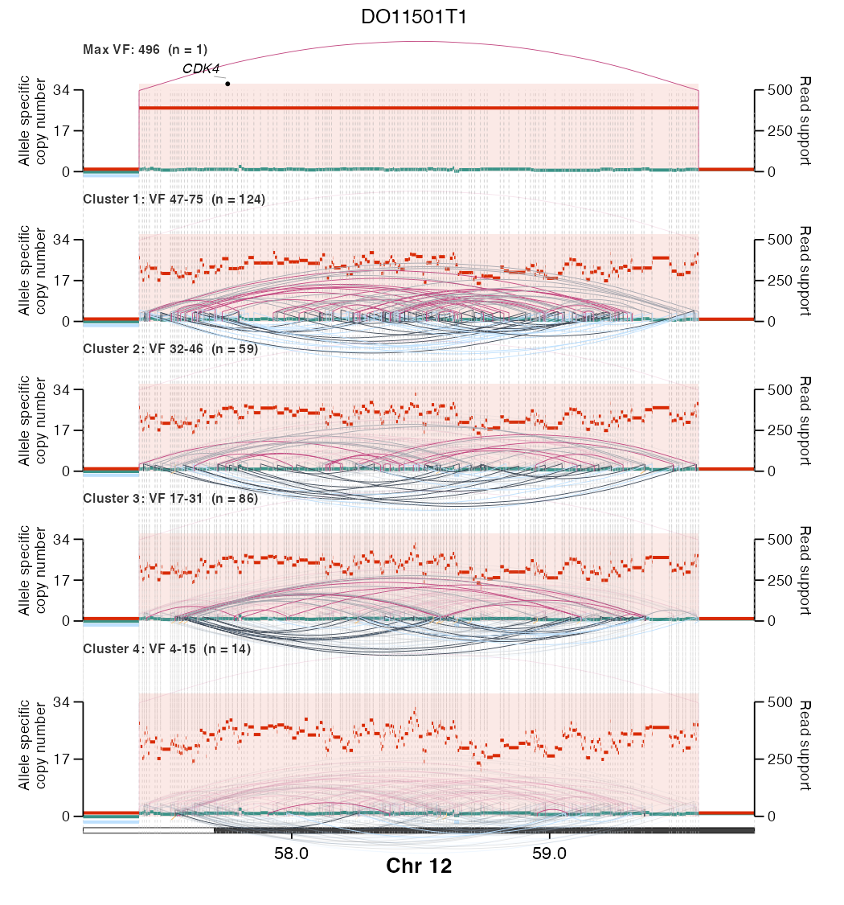

[← EpiTracer](../README.md)

# `plot_sv_reconstruction()` — temporally-stratified amplicon reconstruction

A companion to [`plot_sv_linear()`](plot_sv_linear.md) that turns a single
crowded rearrangement plot into a **stack of panels ordered by read support**,
reconstructing how a focal amplicon is assembled wave by wave. Junctions are
grouped into read-support (variant-fraction, `VF`) strata; the highest-support
junctions — a proxy for the earliest, highest-copy events — sit at the top, and
successively lower-`VF` clusters are added below. Reading top-to-bottom is a
rough temporal decomposition of amplicon evolution.

Each panel draws the same shared, concatenated-locus x-axis with allele-specific
copy number, SV arcs (height = read support), karyotype ideograms, LOH /
homozygous-deletion bars and gene labels — so events line up across the stack.

**What each panel shows (default `cn_display = "reconstruct"`):**

- The single highest-`VF` junction is isolated into its own **"Max VF"** top
  panel; the remaining junctions are clustered on `log(VF)` into **"Cluster
  1…X"** panels (highest `VF` first).
- The **major-allele copy number** is rebuilt cumulatively: each panel adds its
  stratum's breakpoints, subdividing the flat founder baseline until the bottom
  panel equals the full observed profile.
- **LOH and homozygous-deletion** segments are placed on the same timeline —
  each is introduced by the earliest deletion junction that spans it, or, if no
  deletion explains it, shown from the top panel down as pre-existing loss.
- Dashed guides mark every perceptible copy-number transition, aligned down the
  whole stack.

## Example plots

**Multi-locus co-amplification** — `HMF000570T2`: *MDM4* (chr1), *PDGFRA*
(chr4) and *CDK4* (chr12) co-amplified and stitched together by
inter-chromosomal junctions (orange arcs), reconstructed across a "Max VF" panel
and three VF clusters.



**Dense single locus** — `DO11501T1`: a heavily rearranged *CDK4* amplicon on
chr12 whose hundreds of junctions separate into read-support waves.



## Input data

Identical to [`plot_sv_linear()`](plot_sv_linear.md): PURPLE CNV segments
(`cnv_data`) and PURPLE SV / BEDPE breakpoints (`sv_data`) for one sample, plus
a `VF` (read-support) column on `sv_data`. Karyotype ideogram and gene
coordinates default to the small bundled hg38 references, so a minimal call needs
only `sample`, `cnv_data` and `sv_data`. Requires the **patchwork** package to
stack panels (and optionally **Ckmeans.1d.dp** for `k = "auto"`).

## Usage

```r
library(EpiTracer)

# Auto-detect every focal amplicon and reconstruct it (reconstruct is the default):
plot_sv_reconstruction(
  sample   = "HMF000570T2",
  cnv_data = cnv_df, sv_data = sv_df,
  outdir   = "plots"
)

# Focus on one locus, choose the number of VF strata automatically:
plot_sv_reconstruction(
  sample           = "DO11501T1",
  cnv_data         = cnv_df, sv_data = sv_df,
  chromosome       = "chr12",
  chromosome_range = matrix(c(56.2e6, 58.4e6), nrow = 1),
  k                = "auto"
)

# Show EGFR exon models to reveal an intragenic loss (e.g. EGFRvIII = exons 2–7):
plot_sv_reconstruction("DO11441T1", cnv_df, sv_df,
                       displayExon = TRUE, cds_gr = egfr_exons)
```

## Arguments

Only `sample`, `cnv_data` and `sv_data` are **required**; everything else is
optional. Loci resolution, reference data, event thresholds, gene labels and the
appearance/output arguments are shared with
[`plot_sv_linear()`](plot_sv_linear.md) — the table there documents them. The
arguments below are specific to (or most relevant for) the reconstruction plot.

**Required**

| Argument | Description |
| :--- | :--- |
| `sample`   | Sample identifier (matched in `cnv_data` / `sv_data`). |
| `cnv_data` | PURPLE CN segments: `sample`, `seqnames`, `start`, `end`, `copyNumber`, `ploidy`, `majorAlleleCopyNumber`, `minorAlleleCopyNumber`. |
| `sv_data`  | PURPLE SVs / BEDPE: `chrom1`, `start1`, `chrom2`, `start2`, `strand1`, `strand2`, `svclass`, `VF`, `JCN`, `sample`. |

**VF stratification (the panels)**

| Argument | Default | Description |
| :--- | :--- | :--- |
| `vf_col`           | `"VF"`     | Read-support column in `sv_data` (a raw count, clustered on the log scale). |
| `k`                | `"auto"`   | Number of VF strata; `"auto"` (default) picks it (Ckmeans.1d.dp BIC, else a WSS elbow capped at `max_k`), an integer forces it. |
| `max_k`            | `4`        | Upper bound on strata when `k = "auto"`. |
| `vf_breaks`        | `NULL`     | Explicit `VF` cut points (upper edges), e.g. `c(200, 80)`; overrides `k`. |
| `min_vf`           | `1`        | Drop junctions with `VF` below this before clustering. |
| `isolate_founder`  | `TRUE`     | Put the single highest-`VF` junction alone in a top **"Max VF"** panel, excluded from clustering; the rest become **"Cluster 1…X"**. |
| `founder_offscale` | `FALSE`    | Drive the read-support axis by the highest *non*-max-VF junction (so a large outlier doesn't compress the lower panels); the top arc is clamped and axis titles marked "(scaled)". |
| `vf_scale`         | `"shared"` | `"shared"` = one global read-support→CN scale (arc heights compare across panels); `"per_panel"` = each panel fills its own VF range. |

**Copy-number reconstruction**

| Argument | Default | Description |
| :--- | :--- | :--- |
| `cn_display`         | `"reconstruct"` | `"reconstruct"` = cumulative wave-by-wave rebuild (see above); `"actual"` = the observed CN segments near each stratum's breakpoints. |
| `cn_near_flank`      | `1e5`   | In `"actual"` mode, draw CN segments within this many bp of a stratum's breakpoints. |
| `cn_border_lines`    | `TRUE`  | Draw dashed vertical guides at reconstructed CN-segment borders. |
| `cn_border_min_step` | `NULL`  | Minimum CN change for an internal guide; `NULL` = `max(0.25, 0.015 × cn_axis_max)` (a guide at ~every step). |
| `prior_sv_alpha`     | `0.15`  | Opacity of earlier (higher-`VF`) strata re-drawn faintly in each lower panel; `0` shows only the current stratum. |

**Layout & output (reconstruction-specific)**

| Argument | Default | Description |
| :--- | :--- | :--- |
| `drop_empty_strata` | `TRUE` | Drop strata with no drawable in-locus junction. |
| `panel_rel_height`  | `1.4`  | Relative height of the (label-bearing) bottom panel vs the others. |
| `outdir` / `save`   | `NULL` / `TRUE` | Directory to write the stacked PDF; if `outdir` is `NULL`, only the object is returned. |
| `verbose`           | `FALSE` | Print the detected loci, VF strata, and the per-wave LOH / hom-del assignment. |

All other arguments (`chromosome`, `chromosome_range`, `loci`, `events`,
`cluster_gap`, `flank_pct`, `min_amp_width`, `min_cn_ratio`, `gain_ratio`,
`loh_thresh`, `homdel_thresh`, `genes_to_highlight`, `displayExon`, `cds_gr`,
`highlight_amp`, `highlight_hom_del`, sizing, …) behave exactly as in
[`plot_sv_linear()`](plot_sv_linear.md).

Returns a **patchwork** object stacking the per-stratum panels (invisibly when a
file is written); the written PDF path is attached as `attr(p, "path")` and the
per-junction stratum assignment as `attr(p, "strata")`.
